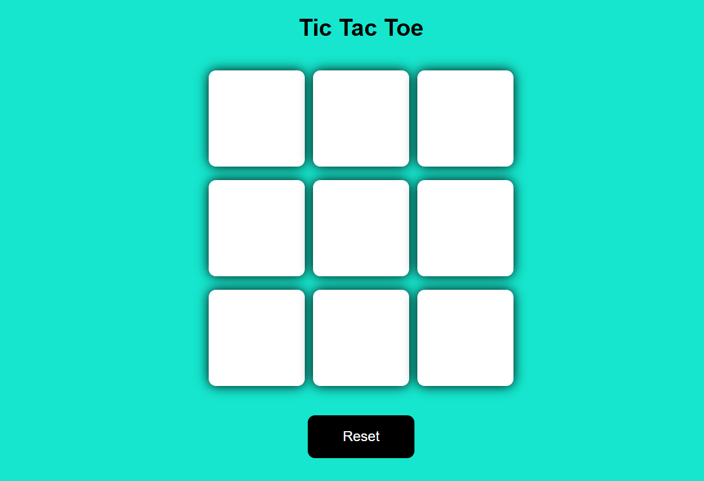
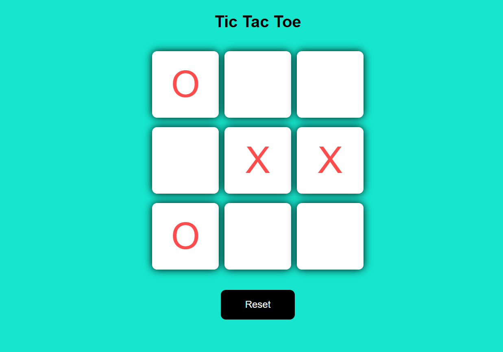
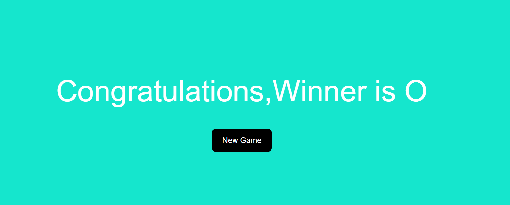

# Tic Tac Toe

A simple and interactive Tic Tac Toe game built using HTML, CSS, and JavaScript. Play against a friend and enjoy the classic game right in your browser!

## Image





<!-- Optionally add a screenshot or a link to the live demo here -->
<!--  -->

## Features

- Classic 3x3 grid Tic Tac Toe gameplay
- Playable by two players on the same device
- Responsive design for desktop and mobile
- Visual indication for the current player
- Highlights the winning combination
- Option to restart the game

## How to Play

1. Open the `index.html` file in your browser.
2. Player 1 uses "X" and Player 2 uses "O".
3. Players take turns to mark a square.
4. The first player to align three marks vertically, horizontally, or diagonally wins.
5. If all squares are filled and no one wins, the game ends in a draw.
6. Click the "Restart" button to play again.

## Getting Started

### Prerequisites

- Any modern web browser (Chrome, Firefox, Edge, Safari, etc.)

### Running Locally

1. Clone or download this repository.
2. Navigate to the project directory.
3. Open `index.html` in your browser.

```
git clone https://github.com/your-username/tic-tac-toe.git
cd tic-tac-toe
# Open index.html with your browser
```

## Project Structure

```
tic-tac-toe/
├── index.html
├── style.css
├── script.js
└── Readme.md
```

- **index.html**: The main HTML file.
- **style.css**: Styles for the game UI.
- **script.js**: JavaScript logic for game functionality.

## Customization

Feel free to modify the styles or add new features, such as:

- AI opponent (single player mode)
- Scoreboard
- Animations and sound effects

## License

This project is licensed under the [MIT License](LICENSE).

## Acknowledgements

- Inspired by the classic Tic Tac Toe game
- Built with ❤️ using HTML, CSS, and JavaScript
